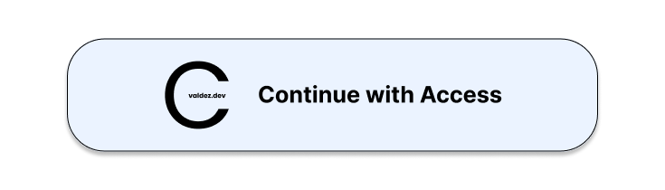

# Access
Access is the authentication system used across [my website](https://cvaldez.dev/). It's my "one account, all apps" 
solution for everything I make. This solution is what I call the "Access Protocol". Read more below.



# Access Protocol
Access is the authentication system used for `cvaldez.dev`. This single account makes it so that people only need one 
account to access all of my projects. This guide will go over how to implement the protocol to ensure consistency.

## The Apps Array
At the top of every `.js` file, an API call to my Portfolio API will be made to create an array. Each object in the 
array consists of these elements:
- `name`: Presented when logging in as "To use `name`, please log in."
- `url`: The URL we are forwarding to
- `id`: The App ID

Here's an example of the array:
```typescript
let apps = [
    {
        "name": "Access",
        "url": "/access/settings/",
        "id": "0"
    },
    {
        "name": "You Are Typing",
        "url": "/typing/messages/",
        "id": "3"
    }
]
```

## The Forwarding System
Access Login URLs are often followed by a `?forward=INTEGER`. The `INTEGER` is meant to represent the App ID. For 
example, `0` is Access, `3` is You Are Typing, etc.

These are some JavaScript tools I use.
```javascript
// Automatically log user in.
if (localStorage.getItem('cvd_token') !== '') {
    if (localStorage.getItem('usernameAndJoinDate') !== null) {
        // Use this to display their username on my website.
        // uAJD.username, uAJD.joined
        let uAJD = JSON.parse(localStorage.getItem('usernameAndJoinDate'));
    }
    
    // Checks to see if the token is valid.
    let xhttp = new XMLHttpRequest();
    xhttp.open("GET", "/api/access/info/");
    xhttp.setRequestHeader('Bearer', localStorage.getItem('cvd_token'));
    xhttp.onreadystatechange = handleInfoRequest;
    xhttp.send();
} else {
    // If the user is not logged in, send them to Access
    // REPLACE `INTEGER` WITH THE APP ID
    window.location.href = '/access/login/?forward=INTEGER'
}
```

```javascript
// handleInfoRequest from above
function handleInfoRequest() {
    if (this.readyState === XMLHttpRequest.DONE && this.status === 200) {
        // Saves username and join date for other apps to use
        let data = JSON.parse(this.responseText);
        localStorage.setItem('usernameAndJoinDate', JSON.stringify({'username': data.username, 'joined': data.joined}));
        
        // Send them to the forwarding URL
        window.location.href = "/typing/messages/";
    } else if (this.readyState === XMLHttpRequest.DONE) {
        // If the request fails, send them to Access
        // REPLACE `INTEGER` WITH APP ID
        window.location.href = `/access/login/?forward=INTEGER`
    }
}
```

```javascript
// Returns the App ID from the URL
function getRedirect() {
    let query = window.location.search;
    let urlParams = new URLSearchParams(query);
    let forward_to = urlParams.get('forward');
    
    // If the App ID corresponds to an object, return data
    
    if (apps[parseInt(forward_to)]) {
        return parseInt(forward_to);
    } else {
        // Otherwise, return user to Access
        return 0
    }
}
```

## The Button
The "Continue with Access" button will be the indicator that the app provided will include the Access protocol. This is 
the code to create the button.

```html
<!--REMEMBER TO REPLACE `INTEGER` WTH YOUR APP ID-->
<a style="text-decoration: none; color: black;" href="/account/login/?forward=INTEGER">
    <div id="button-continue">
         <p>Continue with Access</p>
    </div>
</a>
```

```css
#button-continue {
    color: black;
    background-color: #EBF3FF;

    font-weight: bold;
    font-size: 13px;
    font-family: Arial, Helvetica, sans-serif;

    border: black 1px solid;
    border-radius: 20px;

    width: 280px;
    height: 60px;

    display: flex;
    flex-direction: row;
    flex-wrap: wrap;
    align-items: center;

    box-shadow: 0 5px 5px black;
}
```